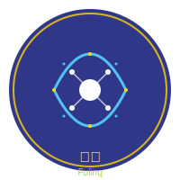
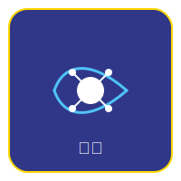

# 🎨 符灵 (Fuling) Logo 使用指南

## 📋 Logo 文件

符灵项目提供两种风格的SVG Logo：

### 1. 圆形Logo (`fuling_logo.svg`)
- **尺寸**: 200×200像素
- **风格**: 简约现代，圆形设计
- **颜色**: 深蓝 (#1a237e) + 金色 (#ffd700) + 浅蓝 (#4fc3f7)
- **用途**: 主Logo，应用图标，头像



### 2. 方形Logo (`fuling_logo_square.svg`)
- **尺寸**: 200×200像素  
- **风格**: 方形带圆角，更正式
- **颜色**: 与圆形Logo一致
- **用途**: 文档头部，方形展示区域



## 🚀 使用方法

### 在Markdown文档中引用
```markdown
<!-- 引用圆形Logo -->


<!-- 引用方形Logo -->

```

### 在HTML中引用
```html
<!-- 引用圆形Logo -->


<!-- 引用方形Logo -->

```

### 在README中使用
```markdown
<div align="center">

# 符灵 (Fuling)


**古代符咒之灵，现代AI智能**

</div>
```

## 🎯 设计理念

### 符号含义
- **中心圆点**: 智慧核心，AI的"灵"
- **数据流线条**: 信息流动，AI处理过程
- **连接点阵**: 二进制/符咒点阵，传统与现代结合
- **外圈装饰**: 古代符咒元素

### 颜色系统
- **主色 (#1a237e)**: 深蓝，代表智慧、稳定
- **强调色 (#ffd700)**: 金色，代表价值、卓越
- **辅助色 (#4fc3f7)**: 浅蓝，代表科技、创新
- **背景色 (#ffffff)**: 白色，代表纯净、清晰

## 📱 适配建议

### 不同尺寸
- **大尺寸 (200px+)**: 完整展示所有细节
- **中等尺寸 (100-200px)**: 保持核心元素可见
- **小尺寸 (<100px)**: 简化显示，保留中心符号

### 不同背景
- **浅色背景**: Logo正常显示
- **深色背景**: 可能需要调整颜色对比度
- **透明背景**: SVG支持透明，可直接使用

## 🔧 技术规格

### 文件格式
- **格式**: SVG (Scalable Vector Graphics)
- **版本**: SVG 1.1
- **编码**: UTF-8
- **视图框**: `viewBox="0 0 200 200"`

### 兼容性
- ✅ 所有现代浏览器
- ✅ GitHub Markdown渲染
- ✅ 文档工具 (Docusaurus, MkDocs等)
- ✅ 设计软件 (Figma, Adobe Illustrator等)

## 📄 许可证

符灵Logo遵循与项目相同的MIT许可证：
- 可以自由使用、修改、分发
- 需要保留版权声明
- 可用于商业用途
- 不提供担保

## 🛠️ 自定义

如需自定义Logo：
1. 使用矢量编辑软件打开SVG文件
2. 修改颜色、尺寸或元素
3. 保持核心设计理念
4. 遵守许可证要求

## 📞 问题反馈

如遇到Logo显示问题：
1. 检查文件路径是否正确
2. 确认浏览器支持SVG格式
3. 在GitHub Issues中报告问题

---

**符灵Logo设计体现了传统与现代的完美结合，象征着AI技术的智慧与创新精神。** 🎨🤖